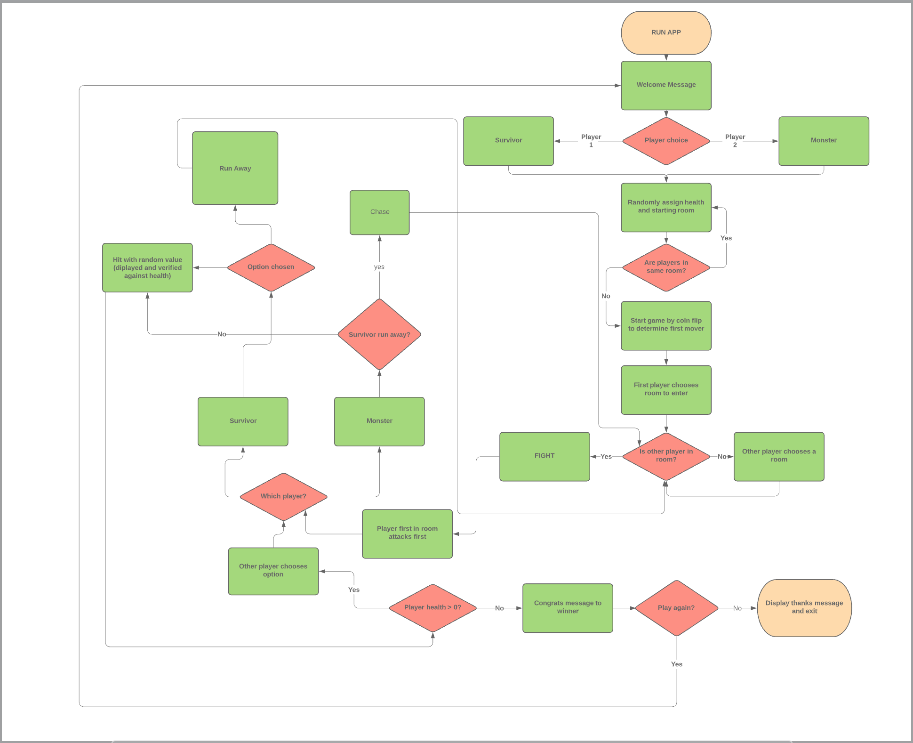

# Software Development Plan

## Statement of Purpose and Scope

#### What is 'TERROR!'?:

'TERROR!' is a Player vs Monster terminal mini-game developed in the Ruby language. The aim of the game is for the player to outlast the monster by fleeing or fighting to survive. The player will interact with the terminal by making input selections from preset options and reacting to the resulting outputs. 

#### The purpose:

The purpose of 'TERROR!' is purely entertainment. It is designed to provide a short yet highly replayable experience of interacting with the terminal for enjoyment and competition. The application does not solve any particular problem save for a few moments of boredom, but that is a noble pursuit in itself. This application has been developed with the passion that drives me to enjoy horror films, gaming, adventure experiences and overall geeky times. I know that it is simple but the simplicity will resonate with like minds in this space. 

#### Target audience:

The target audience for 'TERROR!' is truly anyone. Anyone who likes to play games, interact with computers, relishes competition, or simply wants to pass the time. 

#### How to play:

The player inputs their name into the terminal upon request and the game begins. The player then selects a room to enter out of a selection of six rooms. If the player enters an empty room, they are then able to select from three options: Rest, Look Around, Change Rooms. Resting provides a heal effect of +10 health points (but nothing if selected straight away as the player is already at max health). Looking around is currently a ‘wait’ feature as functionality is not yet implemented. Changing rooms will allow the player to select another room to enter. If the Terror is in the room when the player enters a confrontation happens, requiring the player to select their response: Attack or Flee. If Attack is chosen, both characters will attack each other for a random hit amount. If either character is reduced to 0 or less health, the game is over and the result is logged in recent games and high scores files. If not, the characters remaining health is output to the screen  and the player chooses the room to move into next. If Flee is chosen, the player will move into another room of their choice, away from the Terror. The continued risk is that the player will run into the Terror and eventually fight to the death.

## List of major features

#### Application Menu:

One of the first items that the player encounters is the application menu. This menu has four options, accessed by inputs 1 to 4. 

Number one is 'High Scores'. This feature logs the player's name (or the Monster if the player loses) and the player's score from their interactions in the environment. The points allocation for this feature is in progress, but the logic is valid - storing in a variable and utilising the 'File' class and its underlying 'read' and 'write' methods. It also uses the split method to seperate the entries in the array. 

Number two is ‘Recent Results’. This feature is similar to the ‘High Scores’ option, in that it logs the result of each game, win or loss, against the player’s name (or the Monster if the player loses) in a variable. It is also utilising the 'File' class and its underlying 'read' and 'write' methods. It too uses the split method to seperate the entries in the array.

Number three is ‘Play Game’. This is pretty self-explanatory - it commences the game loop for the player to begin interacting with. 

Number four is ‘Quit’. Again, quite obvious - it exits the application and prints out an exit message to the terminal.

#### Player interaction with their nemesis, the Terror:

Once the player chooses option three in the menu, the game loop commences and the player is then presented with the choice of the room (out of the six available) in which they will start their adventure. When the player runs into the Terror a confrontation option choice is presented - Attack or Flee. Both characters’ set health pools, hit abilities and the player’s rest ability, among other attributes are set out in the ‘Character’ class. 

The hit ability in particular is called upon in the case/when statement in the game loop when the attack option is selected. The player and the Terror each deplete the other’s health pool with a randomly generated number (which interacts the ‘hit’ method). If both characters are still above 0 at this stage the player will flee the Terror and the chase continues until the next interaction. If not, the game ends based on this logic and displays the relevant end of game message.

Alternatively, if the player chooses not to attack, they can flee to another room rather than start the fight sequence. Once in these rooms, the player’s choices of ‘Rest’ and ‘Look Around’ can force the Terror to appear and begin another confrontation. 

#### Recent Game Results and High Scores logs:

An additional feature that has been added to the application is the ability to store the results of each game in two ways: as a win/loss declaration with the player’s/Terror’s name attached, and also the associated score accrued during these games. The basis for the scores are still in development but the structure in the arrays is in place. This feature uses the File class’s abilities of write and read to interact with these lists.

## User Interaction and Experience

#### How to get information on using this application

The application is simple by design to ensure the minimal amount of difficulty to users. However, should you be unsure about how each feature works, feel free to consult the help file in the application's root directory or the feature breakdown above.

#### Error handling and you

While all effort has been put in to avoid unexpected errors with the application, there may be times when an input is invalid or causes an unintended result. Basic error handling has been implemented for issues like incorrect inputs like entering in a number other than 1 - 6 in room selection. You will get an error and request to try again.

## Control Flow Diagram

This is the desired control flow for the game with all ideal features and gameplay mechanics implemented. 

